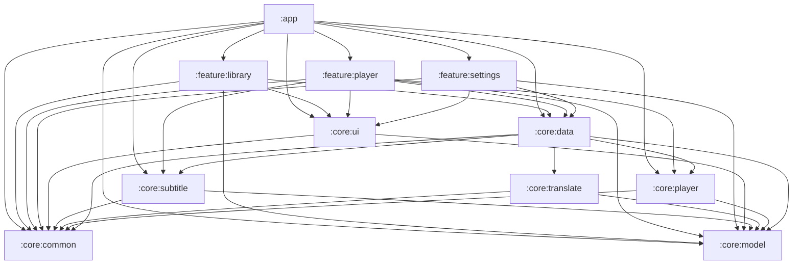

# MultiSuperPlayer

A local audio/video player for Android, focused on its **subtitle/lyrics pipeline** and **subtitle translation**.

- Language: Kotlin + Jetpack Compose (Material 3)
- Playback engine: AndroidX Media3 (ExoPlayer) + the NextLib FFmpeg software-decoding extension
- Minimum: Android 8.0 (API 26)
- Current version: **0.5.5**
- License: [GPL-3.0](LICENSE)

中文文档：[README.md](README.md)

---

## 1. Features

### 1.1 Playback

- **Format coverage.** Container formats are handled by Media3's extractors; when the platform lacks a
  decoder for the codec, playback automatically falls back to the FFmpeg software decoders bundled with
  NextLib. A "force software decoding" switch is provided for the rare file a hardware decoder misjudges.
- **Four aspect modes**: fit / crop / stretch / original. Changing it from the player is a **temporary
  override** and is not written back to settings.
- **Gestures**: vertical drag on the left half adjusts brightness, on the right half adjusts volume,
  horizontal drag seeks, double-tap on either side seeks ±10 s.
- **Speed**: 10 steps from 0.25x to 4x, plus a separate "long-press speed" you can trigger by holding the screen.
- **A-B repeat** with three states (set A, set B, clear).
- **Resume position** for both audio and video. Reaching 95% counts as "finished" and clears it;
  playback shorter than 15 seconds is not recorded.
- **Fullscreen, landscape, screen lock** to avoid accidental touches.
- **Also**: shuffle / repeat all / repeat one, previous / next, volume and brightness indicators,
  a playback service and notification controls.

### 1.2 Lyrics and subtitles

- **Parsers**: SRT / WebVTT / ASS / SSA / LRC / Enhanced LRC (word-by-word) / TTML (DFXP, SMPTE-TT) /
  VobSub / PGS. Unsupported input is never guessed at silently — the registry reports readable
  diagnostics such as "detected as X but the content looks more like Y".
- **Discovery and matching**: the media file's directory is scanned and candidates are scored by filename
  similarity, language tag and `forced` flag; ties are broken by stable rules.
- **Encoding fallback**: non-UTF-8 subtitles (GBK and friends) are tried against a list of candidate
  encodings, and the parse warnings state which one was used.
- **Display modes**: hidden / original only / translation only / bilingual.
- **Never blank.** If you pick "translation only" and the subtitle has no translation, the app falls back
  to showing the original **and says why**, instead of rendering nothing and making you think subtitles
  are broken.
- **Manual edits**: any translated line can be corrected by hand. Corrections are persisted separately and
  survive re-translation.

### 1.3 Subtitle translation

- **Any OpenAI-compatible endpoint**: fill in base URL, model name and API key. Presets for common
  providers are included, and a fully custom configuration is supported.
- **Batching and caching** with context lines and a glossary. Results are cached by a hash of
  (content, target language, model), so identical content is never paid for twice.
- **Glossary**: names and proper nouns are replaced with placeholders before the request and restored
  afterwards, so the model cannot silently rewrite them.
- **Diagnosable failures.** Failures are classified into categories that each require a *different*
  remedy — not configured / unauthorized / quota exhausted / rate limited / rejected / server error /
  network / bad response / empty completion / truncated. The UI offers an action you can actually take,
  and the raw provider message is available on demand.
- **Retry only the failed lines** — a failed batch does not re-translate the lines that already succeeded.
- **Export** to SRT or ASS, translation-only or bilingual, with the target language code in the filename.

### 1.4 Theme

- **Base theme**: follow system / light / dark / pure black (OLED).
- **Color source**: system dynamic color (Android 12+), artwork color extraction, or a fixed accent
  (6 presets).
- The difference between dark and pure black only shows up on a real device: pure black is `#000000`,
  which is what OLED power saving and contrast actually need.
- The theme swaps the **entire tree**, not just the widgets the app draws itself: `MspTheme` sits at the
  outermost level and distributes both the base color scheme and the accent, so `Scaffold`, dialogs,
  dropdown menus and scroll containers never leak a white background.

### 1.5 Localization (delivered in this release)

- **Follow system / Simplified Chinese / Traditional Chinese / English**, switchable in-app under
  Settings → Appearance → Language.
- Simplified Chinese is the resource fallback language (it lives in `values/`); the other two have their
  own `values-en/` and `values-b+zh+Hant/`. An unsupported system language falls back to Simplified Chinese.
- On Android 13+ these languages are registered with the system, so the OS-level per-app language picker
  works too — the two can't drift apart.

### 1.6 Roadmap

| Version | Content | Status |
| --- | --- | --- |
| v0.1 | Module skeleton, media library, subtitle parsers, playback engine, theming | Done |
| v0.2 | Subtitle discovery, matching, parsing, rendering | Done |
| v0.3 | Subtitle translation (local + cloud APIs) | Done |
| v0.4 | FFmpeg software decoding, automatic fallback, force-software switch | Done |
| v0.5 | Playback: fullscreen/landscape, aspect modes, gestures, speed, A-B repeat, resume | Done |
| **v0.5.5** | **Localization + documentation** | **Current** |
| v0.6 | On-device ASR subtitle generation | Planned |
| Later | Cloud ASR, audio translation, equalizer | Planned |

---

## 2. Building and running

### 2.1 Requirements

| Item | Version | Notes |
| --- | --- | --- |
| JDK | **21** | See the JDK pitfall below. Source `jvmTarget` is 17. |
| Android SDK | **compileSdk 36** (`android-36` installed) | `minSdk 26`, `targetSdk 36` |
| Gradle | 8.14.3 (via wrapper) | Distribution served from a Tencent Cloud mirror |
| AGP / Kotlin | 8.13.2 / 2.4.20 | See `gradle/libs.versions.toml` |

#### JDK pitfall (read this first)

**The Gradle daemon must run on JDK 21.** On JDK 25 the build fails, and all it prints is a bare version number:

```text
FAILURE: Build failed with an exception.
* What went wrong:
25.0.1
```

Fix it by adding the following to your **user-level** `~/.gradle/gradle.properties`
(on Windows: `%USERPROFILE%\.gradle\gradle.properties`):

```properties
# Forward slashes are required: backslash is an escape character in .properties,
# so C:\Program Files is silently eaten into C:Program Files
org.gradle.java.home=C:/Program Files/Microsoft/jdk-21.0.8.9-hotspot
# Also register 21 as a known toolchain, so Android Studio's "Gradle JVM criteria"
# (Version: 21) doesn't depend on JAVA_HOME happening to point at 21
org.gradle.java.installations.paths=C:/Program Files/Microsoft/jdk-21.0.8.9-hotspot
```

This goes in the user-level file rather than the project one so that no absolute local path ends up in
version control (`gradle.properties` has a comment saying exactly that). On the Android Studio side:
Settings → Build, Execution, Deployment → Build Tools → Gradle → set "Default Gradle JVM criteria" to
**21**; the auto-detected 25 makes sync fail outright.

> Note the distinction: `JAVA_HOME` only chooses the **launcher** JVM, while `org.gradle.java.home`
> chooses the **daemon** JVM. Having `JAVA_HOME` point at 25 builds fine here because the daemon is pinned to 21.

### 2.2 Mirrors

Everything downloads through mirrors, so no extra configuration is needed where they matter most:

- Gradle distribution: `mirrors.cloud.tencent.com` (`gradle/wrapper/gradle-wrapper.properties`)
- Maven repositories: Aliyun's `gradle-plugin` / `public` / `google`, with the official repositories as
  fallback (`settings.gradle.kts`). Gradle tries them in order, so "the mirror doesn't have this new
  version yet" just falls through instead of failing.
- The only dependency that needs a non-standard repository is `io.github.anilbeesetti:nextlib-media3ext`,
  and it is published on **Maven Central** — so jitpack.io is **not** needed.

### 2.3 Common commands

```bash
# Compile every module
./gradlew assembleDebug

# Compile only (much faster; use this while editing)
./gradlew compileDebugKotlin

# All unit tests
./gradlew test

# A single module's unit tests
./gradlew :core:translate:testDebugUnitTest

# Install to a connected device or emulator
./gradlew installDebug
```

On Windows PowerShell:

```powershell
$env:JAVA_HOME = 'C:\Program Files\Java\jdk-25'
.\gradlew :app:assembleDebug
```

### 2.4 Release signing

Copy `keystore.properties.example` to `keystore.properties`, fill in the real values, and put it in the
repository root (it is already in `.gitignore`). **When the file is missing, release builds silently fall
back to debug signing** so that a fresh clone or a CI run still produces an installable package instead of
failing outright.

### 2.5 One source of truth for the version

The version lives in `appVersionName` at the top of `app/build.gradle.kts`; `versionCode` and BuildConfig
are both derived from it:

```text
versionCode = major * 10000 + minor * 100 + patch      // 0.5.5 -> 505
```

Do not write a second copy of the number in `defaultConfig`. That was how it used to work, and the result
was that git had already tagged v0.5.3 while the package still declared 0.4.0 — **and nothing reported it**.
The build also injects the commit, tag and build time into BuildConfig using `git describe` /
`git rev-parse`, for the About screen. If `git` is not on `PATH`, everything degrades to "unknown" rather
than failing the build.

### 2.6 Test media

`tools/make-test-media.ps1` generates a fixed set of verification assets with ffmpeg (including silent
gaps, bilingual lines, word-by-word LRC, GBK-encoded files and CJK filenames). Typing the ffmpeg commands
by hand always drops one or two of them — and the dropped one is precisely what you were about to test.

```powershell
pwsh -File tools\make-test-media.ps1
pwsh -File tools\make-test-media.ps1 -OutputDir D:\tmp\media -FfmpegPath D:\ffmpeg-build\bin\ffmpeg.exe
```

Output goes to `%TEMP%` by default and is not committed.

---

## 3. Project structure

```text
app/                     App shell: theme wiring, bottom navigation, nav graph, Application/Activity
core/
  common/                Utilities, logging, Result, dispatchers, formatting, MspText
  model/                 Domain models (media entries, subtitles, tracks, playback state) - no module deps
  data/                  Data sources (MediaStore scanning, SAF, settings persistence)
  subtitle/              Subtitle/lyrics parsing engine (pure logic, unit-testable)
  translate/             Subtitle translation (provider presets, batching/cache/glossary, export)
  ui/                    Design system and theming (dynamic color, presets, custom accents)
  player/                Media3 playback wrapper and playback service
feature/
  library/               Media library browsing
  player/                Player screen (audio/video + lyrics/subtitles + translation panel)
  settings/              Settings (theme, language, playback, translation, about)
tools/                   Development helper scripts
```

### Dependency direction



Rules that must not be broken:

1. **`core:model` stays free of module dependencies.** It is the shared vocabulary; the moment it depends
   on something else, the graph gains a cycle. The practical cost of this rule is listed under
   "Known limitations" below.
2. **`feature:*` modules never depend on each other**, and never on `:app` (`:app` depends on them).
   Anything shared across feature domains belongs in `core:*` or travels by navigation.
3. **Only `:app` is a `com.android.application`**; the other ten modules are `com.android.library`.
4. **`android.nonTransitiveRClass=true`**: modules **cannot reference each other's `R` classes.**
   If two modules need the same sentence, each keeps its own copy (for example `core:common`'s
   `msp_wrapped_in_parens` and `feature:player`'s `msp_player_wrapped_in_parens` are the same sentence).
   It looks like duplication, but under this compile-time constraint it is the only approach that cannot break.

### Why user-facing text is `MspText`, not `String`

`Resources` is unusable in JVM unit tests — `testOptions { unitTests.isReturnDefaultValues = true }` makes
every `android.*` call return 0/null. If the pure-logic layers returned `String`, then "what does this
sentence look like in another language" could only be inspected on a device, and not a single assertion
about it could be written.

So the pure-logic layers (`core:common` / `core:player` / `core:translate` / `core:data` / the ViewModels)
return `MspText`: either `Plain` (language-independent by nature, e.g. the format name `SubRip`), or
`Res(id, args)`, which is resolved **at the UI boundary only**. Compose code always goes through

```kotlin
Text(row.label.string())          // import com.multisuperplayer.core.ui.text.string
```

When a sentence is assembled from several parts, do **not** use `buildString` or `"$a · $b"` — the
separator itself is part of the language (Chinese uses `·`, English uses `, `), and the order of the parts
may need to change in another language. Use:

```kotlin
MspText.join(SEPARATOR, listOf(partA, partB, partC))
```

---

## 4. Tests

```bash
./gradlew test
```

- Everything is a **JVM unit test** (JUnit 4); no device or emulator is needed.
- What is covered: subtitle parsers, translation failure classification, batching and caching, export,
  theme enums, settings summary text, and a few **repository-level guards** — for instance "every module
  with a `values/strings.xml` must also have `values-en/` and `values-b+zh+Hant/`". That guard exists
  because the symptom of a missing directory is that switching the app language simply **does nothing**,
  with no error anywhere, and the compiler cannot see it.
- Anything that needs a device (real decoding, real gestures, real SAF) is verified by hand. The
  procedures are recorded in `tools/` and in the KDoc of the relevant modules.

---

## 5. Known limitations

These are deliberate for this release, not oversights:

1. **Some legacy formats still do not play.** NextLib provides **decoders** (codecs), not **demuxers**
   (containers). So "this machine has no decoder for it" can be rescued by it, while "the container format
   is not recognized" cannot: WMV/ASF and RealMedia (RM/RMVB) remain unsupported, and upgrading the library
   will not change that.
2. **DTS / AC-3 inside Matroska is dropped by Media3's extractor**: you get a progress bar, no audio,
   and **no error**. This is upstream behaviour and the project's error mapping cannot see it.
3. **Only `arm64-v8a` and `x86_64` ABIs are kept.** Bundling all four roughly doubles the APK
   (measured uncompressed: 7.5 MB for arm64-v8a, 11.1 MB for x86_64). The cost is that 32-bit devices
   **cannot install it** — the installer refuses outright, rather than installing something that doesn't
   work. Supporting them properly means ABI splits or an AAB.
4. **`core:subtitle` parse warnings are still Chinese.** The warning type is `List<String>`, tied to the
   **dependency-free `core:model`**. The right fix is to move `MspText` into `core:model` (which is itself
   dependency-free, so it fits that module's role) and make the warnings `List<MspText>`. Deferred.
5. **Machine-readable skeletons in the log report and in exported subtitles are deliberately not
   translated.** The log report's header lines (produced by the UI) follow the UI language, but the
   `===== ... =====` and `导出时间:` skeleton stays fixed: it exists to be searched by keyword while
   debugging, and mixing translations in would defeat that. For the same reason the `; 由
   MultiSuperPlayer 导出` provenance line in an exported ASS file is not UI text.
6. **The translation target's "name shown to the model" is fixed to Chinese**
   (`TranslationTarget.promptName`). It describes *what to translate into*, is independent of the UI
   language, and pinning it is what keeps the cache key stable.

---

## 6. License

This project is distributed under the **GNU General Public License v3.0**; see [LICENSE](LICENSE).

That is not an arbitrary choice — it is forced by a dependency: the FFmpeg build that ships with
`io.github.anilbeesetti:nextlib-media3ext` **enables GPL components**. Linking it in means the whole
application must be distributed under GPL-3.0: full source must accompany it, and derivative works must
also be GPL-3.0.

Main third-party dependencies and their licenses:

| Dependency | License |
| --- | --- |
| AndroidX / Jetpack Compose / Media3 | Apache-2.0 |
| Kotlin / kotlinx.coroutines / kotlinx.serialization | Apache-2.0 |
| Koin | Apache-2.0 |
| NextLib (FFmpeg software decoding extension) | **GPL-3.0** |

The "Licenses" section of the About screen lists the components the app actually uses.

---

## 7. Contributing

Issues and pull requests are welcome. Before you start:

- Commit messages and code comments are written in Chinese; identifiers, log keys and resource keys are
  in English.
- **Every new string must also be added to `values-en/` and `values-b+zh+Hant/`**, or the guard test fails.
- Pure-logic layers must not return user-facing text as `String` (see the `MspText` section above).
- Before changing an AndroidX/Compose version in `gradle/libs.versions.toml`, confirm that the target
  version's AAR metadata has `minCompileSdk <= 36` and `minAndroidGradlePluginVersion <= 8.13.2`. Those
  constraints live in `META-INF/com/android/build/gradle/aar-metadata.properties` inside the AAR and are
  **invisible from both the version catalog and the Maven page**; they only blow up during the
  `CheckAarMetadata` task. Likewise, changing `media3` requires changing `nextlib` in lockstep — its
  version scheme is `<the media3 version it supports>-<its own version>`, and a mismatched pair surfaces
  only at **runtime** as `NoSuchMethodError` / `AbstractMethodError`.
