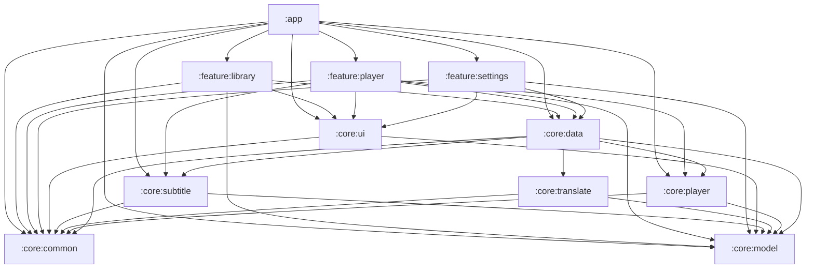

# MultiSuperPlayer

一个 Android 本地音视频播放器，重点在**字幕/歌词系统**与**字幕翻译**。

- 语言：Kotlin + Jetpack Compose（Material 3）
- 播放内核：AndroidX Media3 (ExoPlayer) + NextLib FFmpeg 软件解码扩展
- 最低支持：Android 8.0（API 26）
- 当前版本：**0.5.5**
- 许可证：[GPL-3.0](LICENSE)

English documentation: [README.en.md](README.en.md)

---

## 一、功能特性

### 1. 播放（基础目标）

- **格式覆盖**：容器格式由 Media3 的解复用器负责，编码格式不够用时自动回退到
  NextLib 自带的 FFmpeg 软件解码器；也提供「强制软件解码」开关给少数解码器误判的片子。
- **画面比例**四档：适应 / 裁剪 / 拉伸 / 原始。播放页里改的是**临时覆盖**，不写回设置。
- **手势**：左半屏上下滑调亮度、右半屏上下滑调音量、左右滑动找进度、双击两侧 ±10 秒。
- **倍速**：0.25×~4× 共 10 档；长按屏幕可临时切到「长按倍速」。
- **A-B 循环**：三态（设 A → 设 B → 清除）。
- **续播**：音视频都记；看到 95% 视为看完并清除，不足 15 秒不记。
- **全屏与锁定**：沉浸式全屏 + 横屏布局 + 误触锁屏。
- **其他**：随机/列表循环/单曲循环、上一首/下一首、音量与亮度指示、播放服务与通知栏控制。

### 2. 歌词与字幕（基础目标）

- **解析格式**：SRT / WebVTT / ASS / SSA / LRC / 增强型 LRC（逐字）/ TTML(DFXP, SMPTE-TT) / VobSub / PGS。
  未支持的格式不会瞎猜——注册表会给出「格式判定为 X 但内容更像 Y」这类可读的诊断。
- **自动发现与关联**：扫描媒体文件所在目录，按文件名相似度、语言标记、`forced` 标记等打分选出最合适的字幕；同分时按尾部标签数量等规则稳定排序。
- **编码兜底**：非 UTF-8（GBK 等）字幕按候选编码逐个尝试，并在解析告警里说明用了哪一种。
- **显示模式**：隐藏 / 仅原文 / 仅译文 / 双语。
- **不显示空白**：选了「仅译文」而这份字幕没有译文时，自动降级显示原文**并给出原因**，而不是画出一片空白让用户以为字幕坏了。
- **人工修正**：任意一行译文都可以手改，修正内容单独持久化，重新翻译不会被覆盖。

### 3. 字幕翻译（进阶目标）

- **任意 OpenAI 兼容服务**：填服务地址、模型名、API 密钥即可；内置若干常见服务商预设，也可完全自定义。
- **批量翻译 + 缓存**：按行分批、带上文语境、带术语表；结果按「内容 + 目标语言 + 模型」哈希缓存，重复内容不重复付费。
- **术语表**：人名/专有名词先替换成占位符再交给模型，避免模型擅自改写，译后还原。
- **失败可诊断**：把失败分成「没配置 / 未授权 / 额度用尽 / 限流 / 被拒 / 服务端错误 / 网络 / 响应不合法 / 空回复 / 被截断」
  这些**各自有不同处理方式**的类别，界面给的是能真正执行的动作，原始报错可以展开看。
- **只重试失败的行**：整批失败不会让成功的行白翻一遍。
- **导出**：SRT / ASS，仅译文或双语，文件名带目标语言代码。

### 4. 界面与主题（进阶目标）

- **主题基底**：跟随系统 / 浅色 / 深色 / 纯黑（OLED）。
- **取色来源**：系统动态取色（Android 12+）/ 从封面取色 / 固定强调色（6 种预设）。
- **深色与纯黑的差异**在真机上才看得出来：纯黑是纯 `#000000`，为 OLED 省电与对比度服务。
- 主题是**整棵树一起换**而不是只换自己画的控件：`MspTheme` 在最外层把底色调色板（`ColorScheme`）
  和强调色一起往下发，所以 `Scaffold`、对话框、下拉菜单、滚动容器不会漏出白色底。

### 5. 多语言（本项目已完成）

- 支持**跟随系统 / 简体中文 / 繁體中文 / English**，应用内即可切换（设置 → 外观 → 语言）。
- 简体中文是资源兜底语言（住在 `values/`），另外两种各自有 `values-en/`、`values-b+zh+Hant/`；
  系统语言不在支持列表里时回落到简体中文。
- Android 13+ 会把这些语言注册给系统，于是**系统设置里的「应用语言」也能改**，两边不会不一致。

### 6. 路线图

| 版本 | 内容 | 状态 |
| --- | --- | --- |
| v0.1 | 模块骨架、媒体库、字幕解析引擎、播放内核、主题系统 | 已完成 |
| v0.2 | 字幕发现 · 关联 · 解析 · 渲染 | 已完成 |
| v0.3 | 字幕翻译（本地 + 云端 API） | 已完成 |
| v0.4 | FFmpeg 软件解码 + 自动回退 + 强制软解开关 | 已完成 |
| v0.5 | 播放增强：全屏/横屏/画面比例/手势/倍速/A-B 循环/续播 | 已完成 |
| **v0.5.5** | **多语言支持 + 文档** | **当前** |
| v0.6 | 本地 ASR 字幕生成 | 计划中 |
| 后续 | 云端 ASR 字幕生成、音频翻译、均衡器 | 计划中 |

---

## 二、构建与运行

### 1. 环境要求

| 项 | 版本 | 说明 |
| --- | --- | --- |
| JDK | **21** | 见下面的「JDK 坑」。源码 `jvmTarget` 是 17。 |
| Android SDK | **compileSdk 36**（需装 `android-36`） | `minSdk 26`，`targetSdk 36` |
| Gradle | 8.14.3（wrapper 自带） | 分发地址用腾讯云镜像 |
| AGP / Kotlin | 8.13.2 / 2.4.20 | 见 `gradle/libs.versions.toml` |

#### JDK 坑（务必先读）

**Gradle 的 daemon 必须跑在 JDK 21 上。** 跑在 JDK 25 上时构建会失败，而且报出来的东西只有一行版本号：

```text
FAILURE: Build failed with an exception.
* What went wrong:
25.0.1
```

修复方式：在**用户级** `~/.gradle/gradle.properties`（Windows：`%USERPROFILE%\.gradle\gradle.properties`）里加：

```properties
# 路径必须用正斜杠：.properties 里反斜杠是转义符，写成 C:\Program Files 会被吃成 C:Program Files
org.gradle.java.home=C:/Program Files/Microsoft/jdk-21.0.8.9-hotspot
# 顺便把 21 登记为已知工具链，Android Studio 的 Gradle JVM criteria（Version: 21）就不用依赖 JAVA_HOME
org.gradle.java.installations.paths=C:/Program Files/Microsoft/jdk-21.0.8.9-hotspot
```

写在用户级而不是项目里，是为了**不把本机绝对路径提交进仓库**（`gradle.properties` 里有一条注释专门说明这一点）。
Android Studio 侧对应设置：Settings → Build, Execution, Deployment → Build Tools → Gradle →
「Default Gradle JVM criteria」的 Version 选 **21**；默认推导出来的 25 会让同步直接失败。

> 注意区分：`JAVA_HOME` 只决定**启动器** JVM，`org.gradle.java.home` 决定**daemon** JVM。
> 本机 `JAVA_HOME` 指向 25 也能正常构建，因为 daemon 被钉在了 21。

### 2. 依赖镜像

国内网络下所有下载都已经走镜像，不需要额外配置：

- Gradle 发行包：`mirrors.cloud.tencent.com`（`gradle/wrapper/gradle-wrapper.properties`）
- Maven 仓库：`maven.aliyun.com` 的 `gradle-plugin` / `public` / `google`，官方源兜底
  （`settings.gradle.kts`；镜像里缺某个新版本时会自动往后找，不会因此失败）
- 唯一需要外部仓库的依赖是 `io.github.anilbeesetti:nextlib-media3ext`，它在 **Maven Central** 上，
  所以**不需要 jitpack.io**。

### 3. 常用命令

```bash
# 编译全部模块
./gradlew assembleDebug

# 只编译不打包（快得多，日常改代码用这个）
./gradlew compileDebugKotlin

# 全量单元测试
./gradlew test

# 单个模块的单元测试
./gradlew :core:translate:testDebugUnitTest

# 安装到已连接的设备 / 模拟器
./gradlew installDebug
```

Windows PowerShell 下临时指定 JDK：

```powershell
$env:JAVA_HOME = 'C:\Program Files\Java\jdk-25'
.\gradlew :app:assembleDebug
```

### 4. Release 签名

把根目录的 `keystore.properties.example` 复制成 `keystore.properties` 并填入真实值（该文件已被 `.gitignore` 忽略）。
**文件缺失时 Release 会自动回退到 debug 签名**，保证新克隆的仓库和 CI 依然能产出可安装的包，而不是直接构建失败。

### 5. 版本号只有一个来源

版本号写在 `app/build.gradle.kts` 顶部的 `appVersionName`，`versionCode` 与 BuildConfig 都由它推导：

```text
versionCode = major * 10000 + minor * 100 + patch      // 0.5.5 → 505
```

不要在 `defaultConfig` 里另写一份数字 —— 以前就是这么写的，结果 git tag 已经打到 v0.5.3 了，
包里还写着 0.4.0，而且**不会有任何东西报错**。构建时还会用 `git describe` / `git rev-parse` 把
commit、tag、构建时间注入 BuildConfig，供「关于」页显示；`git` 不在 PATH 上时全部降级成「未知」，不会构建失败。

### 6. 测试素材

`tools/make-test-media.ps1` 会用 ffmpeg 生成一套固定的验证素材（含空档、双语句式、逐字 LRC、
GBK 编码、中文文件名）。手动敲 ffmpeg 每次都会漏掉其中一两项，而漏掉的那项恰好就是这次要测的。

```powershell
pwsh -File tools\make-test-media.ps1
pwsh -File tools\make-test-media.ps1 -OutputDir D:\tmp\media -FfmpegPath D:\ffmpeg-build\bin\ffmpeg.exe
```

输出默认落在 `%TEMP%` 下，不进版本库。

---

## 三、项目结构

```text
app/                     应用壳：主题装配、底部导航、导航图、Application/Activity
core/
  common/                工具、日志、Result、调度器、格式化、MspText（延迟解析文案）
  model/                 领域模型（媒体条目、字幕、轨道、播放状态）——零模块依赖
  data/                  数据来源（MediaStore 扫描、SAF、设置持久化）
  subtitle/              字幕/歌词解析引擎（纯逻辑，可单测）
  translate/             字幕翻译（厂商预设、批量/缓存/术语表、导出；纯逻辑 + 无依赖 HTTP）
  ui/                    设计系统与主题（动态取色、预设、自定义）
  player/                Media3 播放内核封装与播放服务
feature/
  library/               媒体库浏览
  player/                播放页（音/视频 + 歌词字幕 + 翻译面板）
  settings/              设置（主题、语言、播放、翻译、关于）
tools/                   开发辅助脚本
```

### 依赖方向



几条**不要破坏**的规则：

1. **`core:model` 保持零模块依赖。** 它是所有人共享的词汇表；一旦它开始依赖别的东西，
   依赖图就会长出一个环。这条规则的实际代价见下面的「已知限制」。
2. **`feature:*` 之间互不依赖**，也**不能依赖 `:app`**（`:app` 依赖它们）。
   跨功能域要共享的东西放 `core:*` 或走导航。
3. **只有 `:app` 是 `com.android.application`**，其余 10 个模块都是 `com.android.library`。
4. **`android.nonTransitiveRClass=true`**：模块之间**不能互相引用 `R` 类**。
   同一条文案若两个模块都要用，就在各自模块里各写一份（例如 `core:common` 的
   `msp_wrapped_in_parens` 与 `feature:player` 的 `msp_player_wrapped_in_parens` 是同一句话）。
   这看起来是重复，但它是这条编译期约束下唯一不会出错的做法。

### 文案为什么是 `MspText` 而不是 `String`

JVM 单元测试里 `Resources` 是不可用的（`testOptions { unitTests.isReturnDefaultValues = true }`
让 `android.*` 一律返回 0/null）。如果纯逻辑层直接返回 `String`，那么「同一句话在不同语言下
是什么样子」就只能在真机上看，一条断言都写不了。

所以纯逻辑层（`core:common` / `core:player` / `core:translate` / `core:data` / 各 ViewModel）
返回 `MspText`：要么是 `Plain`（本来就跟语言无关，比如格式名 `SubRip`），
要么是 `Res(id, args)`（**到 UI 边界才解析**）。Compose 侧一律用

```kotlin
Text(row.label.string())          // import com.multisuperplayer.core.ui.text.string
```

一个句子由多段拼起来时，**不要**用 `buildString` / `"$a · $b"` —— 分隔符也是语言的一部分
（中文是 `·`、英文是 `, `），而且拼接顺序在别的语言里可能要调换。用：

```kotlin
MspText.join(SEPARATOR, listOf(partA, partB, partC))
```

---

## 四、测试

```bash
./gradlew test
```

- 全部是 **JVM 单元测试**（JUnit 4），不需要设备或模拟器。
- 测的是纯逻辑：字幕解析器、翻译失败分类、批量与缓存、导出、主题枚举、设置摘要文案、
  以及若干**仓库级守卫**（例如「每个带 `values/strings.xml` 的模块都必须有 `values-en/` 与
  `values-b+zh+Hant/`」——这条守卫存在的理由是：漏建目录的症状是用户切了语言之后界面**没变**，
  一句报错都没有，编译器够不着）。
- 需要设备的部分（真实解码、真实手势、真实 SAF）在真机上手工验证，验证方法记录在
  `tools/` 与各模块的 KDoc 里。

---

## 五、已知限制

这些是**当前版本有意留下**的，不是被忘掉的：

1. **部分老格式放不了。** NextLib 提供的是**解码器**（编码格式），不是**解封装器**（容器格式）。
   因此「本机没有解码器」能被它救回来，「无法识别封装格式」不能：WMV/ASF、RealMedia(RM/RMVB)
   至今仍不支持，升级这个库也解决不了。
2. **Matroska 里的 DTS / AC-3 会被 Media3 的解复用器丢掉**：有进度条、没声音、**不报错**。
   这是上游行为，本项目的错误映射看不到它。
3. **ABI 只保留 `arm64-v8a` 和 `x86_64`。** 四个 ABI 全打进一个包会让 APK 无谓地大一倍
   （实测 arm64-v8a 7.5MB + x86_64 11.1MB，未压缩）。代价是 32 位设备**装不上**——
   不是装上了用不了，是安装器直接拒绝。要覆盖老设备应该加 ABI split 或改发 AAB。
4. **`core:subtitle` 的解析告警仍是中文。** 告警类型是 `List<String>`，与**零依赖的
   `core:model`** 绑在一起。正确修法是把 `MspText` 移到 `core:model`（它本身零依赖，符合该模块定位），
   再让告警变成 `List<MspText>`。留到后续版本做。
5. **日志报告与导出字幕里的机器可读骨架刻意不翻译。** 日志报告的抬头行（来自界面）跟着界面语言走，
   但 `===== … =====`、`导出时间:` 这些骨架保持固定：它是排查问题时给人搜索用的，混进译文反而
   会让按关键字搜索失效。同理，导出的 ASS 文件里那一行 `; 由 MultiSuperPlayer 导出` 是溯源标记，
   不是界面文案。
6. **翻译目标语言的「给模型看的名字」固定为中文**（`TranslationTarget.promptName`）。
   它描述的是「要翻成什么」，与界面语言无关，而且固定下来才能让缓存键稳定。

---

## 六、开源许可

本项目以 **GNU General Public License v3.0** 分发，见 [LICENSE](LICENSE)。

这不是随便选的，而是被依赖决定的：`io.github.anilbeesetti:nextlib-media3ext` 附带的 FFmpeg 构建
**启用了 GPL 组件**，链接进来意味着整个应用必须随 GPL-3.0 分发——需要附带完整源码，
衍生作品也必须采用 GPL-3.0。

主要第三方依赖与其许可：

| 依赖 | 许可 |
| --- | --- |
| AndroidX / Jetpack Compose / Media3 | Apache-2.0 |
| Kotlin / kotlinx.coroutines / kotlinx.serialization | Apache-2.0 |
| Koin | Apache-2.0 |
| NextLib（FFmpeg 软件解码扩展） | **GPL-3.0** |

「关于」页里的「许可证」一节会列出应用内实际使用的这些组件。

---

## 七、贡献

欢迎提 issue 与 PR。动手前请留意：

- 提交信息与代码注释使用中文；标识符、日志 key、资源 key 用英文。
- **新增文案必须同时补 `values-en/` 与 `values-b+zh+Hant/`**，否则守卫测试会失败。
- 纯逻辑层不要直接返回 `String` 形式的用户可见文案（见上文 `MspText` 一节）。
- 修改 `gradle/libs.versions.toml` 里的 AndroidX/Compose 版本前，先确认目标版本的 AAR 元数据里
  `minCompileSdk ≤ 36` 且 `minAndroidGradlePluginVersion ≤ 8.13.2`：
  这些约束写在 AAR 内的 `META-INF/com/android/build/gradle/aar-metadata.properties` 里，
  **Gradle 版本目录和 Maven 页面都看不出来**，只有在 `CheckAarMetadata` 阶段才会炸出来。
  同理，改 `media3` 时必须同步改 `nextlib`——它的版本号规则是 `<它支持的 media3 版本>-<自身版本>`，
  不匹配的组合会在**运行时**以 `NoSuchMethodError` / `AbstractMethodError` 出现，编译期完全看不出来。
